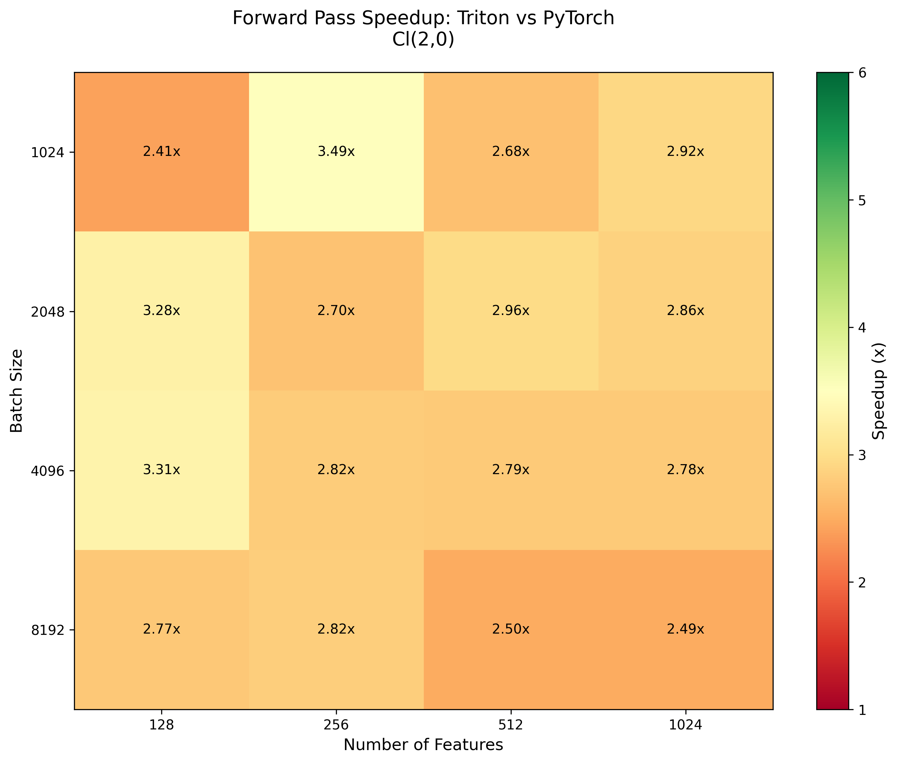
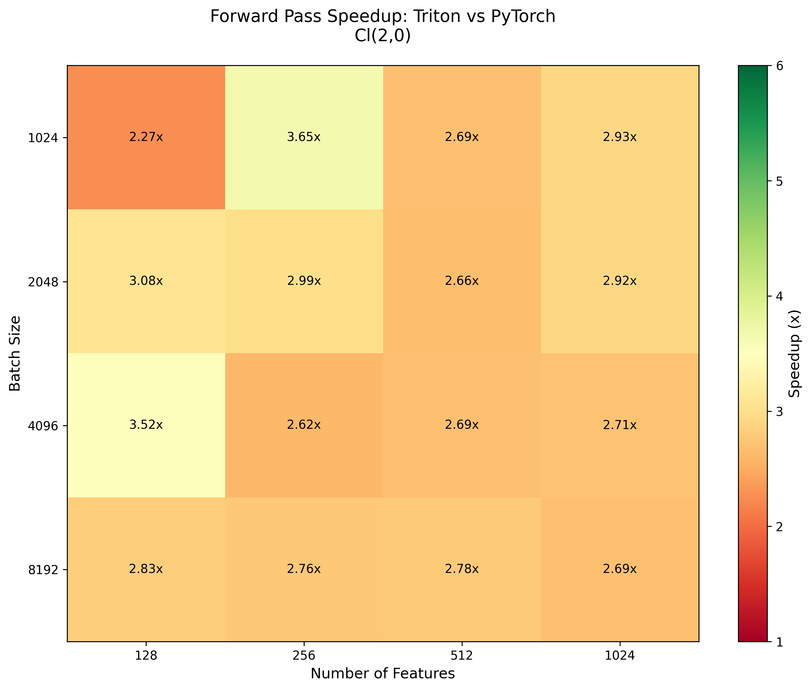
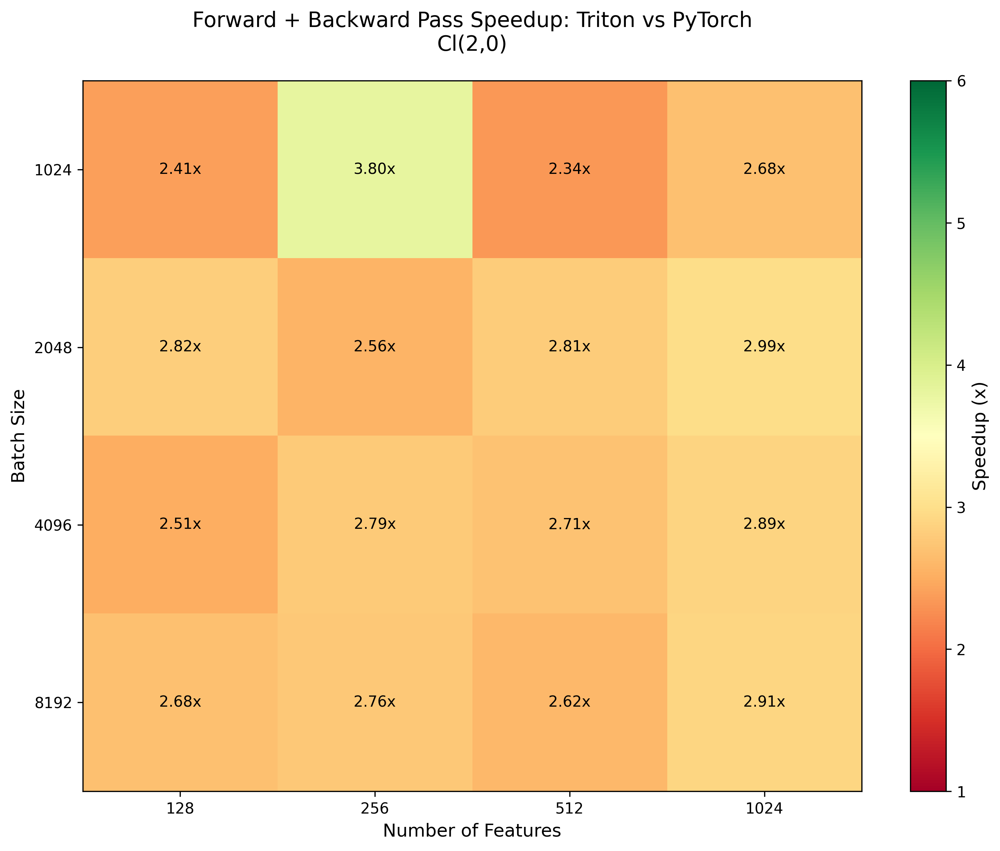
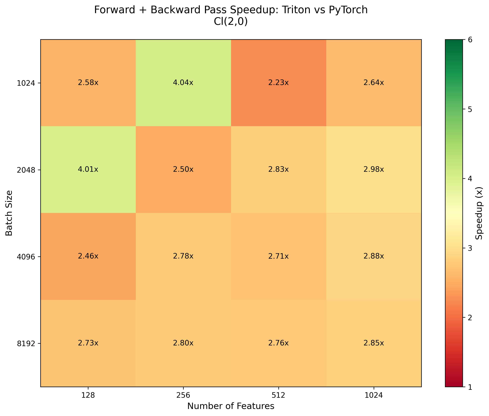
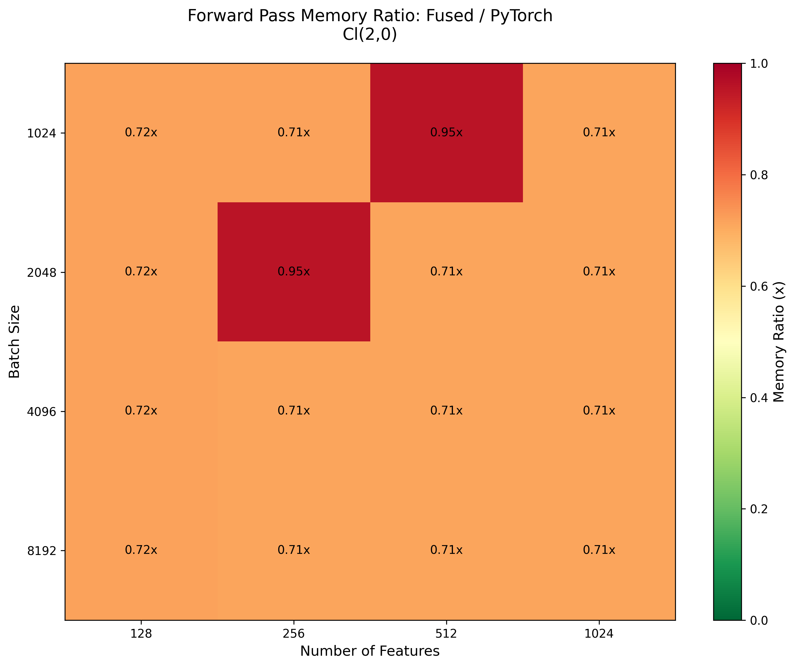
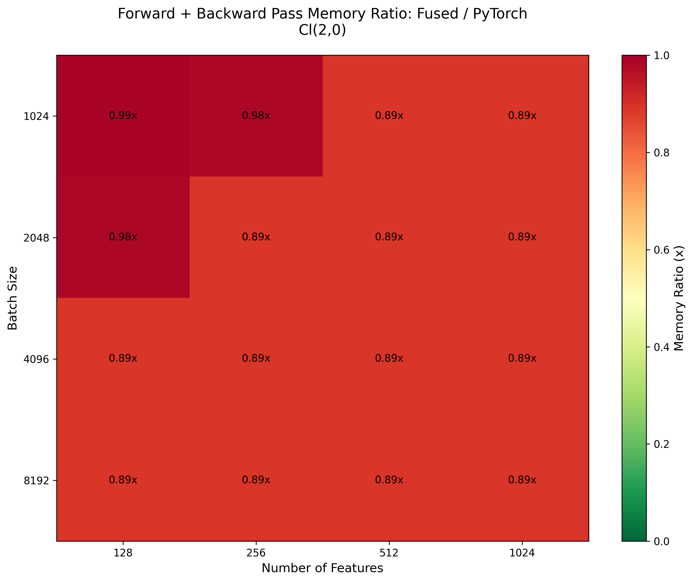

# Flash Kingdon
`flash-kingdon` provides efficient Triton-based implementations of Clifford algebra-based models.
It is a fork of [`flash-clifford`](https://github.com/maxxxzdn/flash-clifford), aimed at showing how the fantastic work done in 
`flash-clifford` can be made more scalable by leveraging the symbolic code optimization and CSE of the [`kingdon`](https://github.com/tBuLi/kingdon) package.

`flash-kingdon` allows you to focus on writing efficient triton kernels, while kingdon automatically generates extremelly efficient implementations of geometric algebra operations for you that are compatible with triton.
<div align="center">

</div>

## $O(n)$-Equivariant operators
Currently only $O(2)$ and $O(3)$-equivariant have been implented (more to follow):
- `fused_gelu_sgp_norm_nd`: multivector GELU $\rightarrow$ weighted geometric product $\rightarrow$ (optionally) multivector RMSNorm

The geometric algebra part of the 2D VGA triton kernels is implemented as follows:
```py
from kingdon import Algebra, MultiVector
from sympy import symbols, Symbol
import triton

VGA2D = Algebra(2)
X = VGA2D.multivector(name='x')
Y = VGA2D.multivector(name='y')
ws = symbols('w:10')
weights = VGA2D.scalar(e=ws)
gate = VGA2D.scalar(name='gate')
go = VGA2D.multivector(name='go')  # go: grad output

# Compile the weighted geometric product and its gradient kernels
@VGA2D.compile(symbolic=True)
def weighted_gp(X, Y, weights: MultiVector[10]) -> MultiVector:
    w0,w1,w2,w3,w4,w5,w6,w7,w8,w9 = weights
    X0, X1, X2 = (X.grade(g) for g in range(VGA2D.d + 1))
    Y0, Y1, Y2 = (Y.grade(g) for g in range(VGA2D.d + 1))
    return w0*X0*Y0 + w3*(X1|Y1) + w7*X2*Y2 \
         + w1*X0*Y1 + w4*X1*Y0 + w5*X1*Y2 + w8*X2*Y1 \
         + w2*X0*Y2 + w6*(X1^Y1) + w9*X2*Y0

@VGA2D.compile(symbolic=True, codegen_symbolcls=Symbol)
def weighted_gp_grad(x, y, weights: MultiVector[10], go) -> MultiVector[18]:
    """Compute the gradient of the weighted geometric product with respect to the inputs and weights."""
    syms: list[Symbol] = [*x.values(), *y.values(), *weights.e]
    wgp_output = weighted_gp(x, y, weights)
    go_wgp = wgp_output.sp(~go)  # sp -> scalar product
    return [go_wgp.map(lambda v: v.diff(s)) for s in syms]
    
# Extract the compiled function for inputs of shape X, Y, weights, and go.
weighted_gp_func = weighted_gp[X, Y, weights].func
weighted_gp_grad_func = weighted_gp_grad[X, Y, weights, go].func

# Decorate with triton.jit to convert the compiled GA expression into a valid triton kernel.
weighted_gp_kernel = triton.jit(weighted_gp_func)
weighted_gp_grad_kernel = triton.jit(weighted_gp_grad_func)
```
The source code generated for `weighted_gp_grad_func` is
```py
def weighted_gp_grad_F_x_F_x_1_x_F(A, B, C, D):
    (x, x1, x2, x12,) = A
    (y, y1, y2, y12,) = B
    (C_0,) = C
    (weights_0, weights_1, weights_2, weights_3, weights_4, weights_5, weights_6, weights_7, weights_8, weights_9,) = C_0
    (go, go1, go2, go12,) = D
    _x0 = go*weights_0
    _x1 = go1*weights_1
    _x2 = go2*weights_1
    _x3 = go12*weights_2
    _x4 = go*weights_3
    _x5 = weights_4*y
    _x6 = weights_5*y12
    _x7 = go12*weights_6
    _x8 = go*weights_7
    _x9 = go12*weights_9
    _x10 = go2*weights_8
    _x11 = go1*x1
    _x12 = go2*x2
    _x13 = go1*x2
    return [[
        _x0*y + _x1*y1 + _x2*y2 - _x3*y12,
        _x4*y1 + _x5*go1 + _x6*go2 - _x7*y2,
        _x4*y2 + _x5*go2 - _x6*go1 + _x7*y1,
        -_x10*y1 - _x8*y12 - _x9*y + go1*weights_8*y2,
        _x0*x + _x11*weights_4 + _x12*weights_4 - _x9*x12,
        _x1*x - _x10*x12 + _x4*x1 + _x7*x2,
        _x2*x + _x4*x2 - _x7*x1 + go1*weights_8*x12,
        -_x13*weights_5 - _x3*x - _x8*x12 + go2*weights_5*x1,
        go*x*y,
        go1*x*y1 + go2*x*y2,
        -go12*x*y12,
        go*x1*y1 + go*x2*y2,
        _x11*y + _x12*y,
        -_x13*y12 + go2*x1*y12,
        -go12*x1*y2 + go12*x2*y1,
        -go*x12*y12,
        go1*x12*y2 - go2*x12*y1,
        -go12*x12*y
    ]]
```
We did not have to write any of this; `kingdon` automatically generated this code and performed the CSE in order to make the code is performant as possible. Contrasting this to the original [implementation](https://github.com/maxxxzdn/flash-clifford/blob/8800de0c67037b8ff5473262254a9a7986e36e5e/ops/p2m0.py#L370), `kingdon` has isolated 14 intermediary results instead of the previous 12, and we did not have to write any of this code into the triton kernel ourselves.
This highlights the benefits of using `kingdon` for the code generation for geometric operations:
- as a user you just have to write high-level code for geometric algebra operations, but still get the benefits of hand-optimized code.
- easier to extend to other geometric kernels such as [`group action layers`](https://arxiv.org/pdf/2302.06594) or to other algebras such as $\mathbb{R}_{3,0,1}$ or $\mathbb{R}_{1,3}$. 

Let's put some benchmarks to these claims.

## Performance

| Metric | Flash-Clifford (`p2m0`) | Flash-Kingdon (`p2m0_kingdon`) |
|--------|-------------------------|--------------------------------|
| **Forward Pass Speedup** |  |  |
| **Forward + Backward Pass Speedup** |  |  |
| **Forward Pass Memory Ratio** |  |  |
| **Forward + Backward Pass Memory Ratio** |  |  |

| Metric | Flash-Clifford (`p3m0`) | Flash-Kingdon (`p3m0_kingdon`) |
|--------|-------------------------|--------------------------------|
| **Forward Pass Speedup** |  |  |
| **Forward + Backward Pass Speedup** |  |  |
| **Forward Pass Memory Ratio** |  |  |
| **Forward + Backward Pass Memory Ratio** |  |  |

Conclusion: both `flash-clifford` and `flash-kingdon` are pretty much indistinguishable in their performance increase over the reference torch implementation; we have to check if the small deviations between the two are significant.

## Requirements
The following requirements must be satisfied:
- PyTorch
- Triton >= 3.0
- kingdon

If you want to run tests, additionally:
- NumPy
- matplotlib

## Benchmarking

Run benchmarks (runtime + memory) with:
```bash
python -m tests.benchmarks.p2m0_kingdon
python -m tests.benchmarks.p2m0
```
This will generate a heatmap comparison against a torch-compiled implementation.

## Testing

To verify correctness against a PyTorch baseline:
```bash
python -m tests.p2m0
python -m tests.p2m0_kingdon
```
which will check both forward and backward (gradient) passes as well as measure the runtime and memory consumption.

## TODO

- Implement and benchmark Fully Connected layers
- The default code printer of `kingdon` uses tuple unpacking, but we can make a custom printer that uses `triton.language`'s `load` and `store` methods out of the box, thereby abstracting even more code writing efforts away.